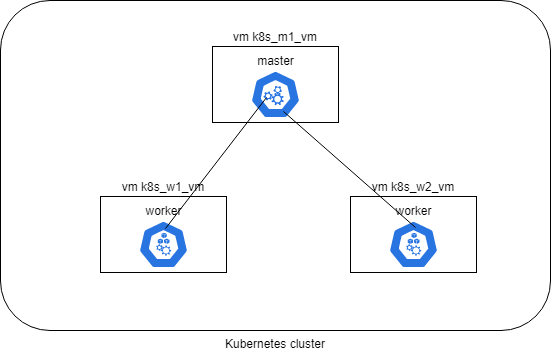

# openwhisk_on_k8s_cluster



## prerequisites
a Linux shell (or Cygwin) with Python and pip installed.
Then install ansible

```shell
pip install ansible
```

## installing the Kubernetes cluster

launch the following command

```shell
ansible-playbook -i target/inventory ansible/deploy_kube.yaml
```

## installing OpenWhisk on the Kubernetes cluster

```shell
ansible-playbook -i target/inventory ansible/install_openwhisk.yaml
```
## configuring the Openwhisk CLI environnement on the client

on your local machine download https://github.com/apache/openwhisk-cli/releases/download/1.1.0/OpenWhisk_CLI-1.1.0-linux-amd64.tgz
and launch:

endpoint
```shell
wsk property set --apihost https://<public ip of your endpoint vm>:31001
```

default username and password (should be changed on the server)
```shell
wsk property set --auth 23bc46b1-71f6-4ed5-8c54-816aa4f8c502:123zO3xZCLrMN6v2BKK1dXYFpXlPkccOFqm12CdAsMgRU4VrNZ9lyGVCGuMDGIwP
```

## creating a javascript function in OpenWhisk
put the following code in a hello.js file on your local machine
```javascript
const os = require('os')
 
function main(params) {
    const name = params && params.name || 'anonymous'
    const hostname = os.hostname()
    const message = `Hello2 ${name} from ${hostname}`
    const body = JSON.stringify({
        name,
        hostname,
        message
    })
    const response = {
        statusCode: 200,
        headers: { 'Content-Type': 'application/json' },
        body
    }
    return response
}
```

launch the following commmand to deploy the function
```shell
wsk -i action create hello hello.js
```

use the following command to call the function
```shell
wsk -i -d action invoke hello --result --param name test
```

or with curl:
```shell
curl -H 'Content-Type':'application/json' -d '{"name":"test"}' -XPOST -k -u 23bc46b1-71f6-4ed5-8c54-816aa4f8c502:123zO3xZCLrMN6v2BKK1dXYFpXlPkccOFqm12CdAsMgRU4VrNZ9lyGVCGuMDGIwP https://<public ip>:31001/api/v1/namespaces/_/actions/hello?blocking=true&result=true
```